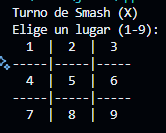

# Juego del Gato (Tres en Línea)

Este es un proyecto sencillo desarrollado en Java como práctica de programación orientada a objetos y estructuras de control. El objetivo del juego es permitir que dos jugadores compitan en una partida de Tres en Línea desde la consola.



## Características

* Juego para dos jugadores.
* Tablero de 3x3 que se imprime en consola.
* Detección de ganadores y empates.
* Control de turnos alternos entre los jugadores.
* Validación de jugadas inválidas.

## Requisitos

* JDK 8 o superior
* Entorno para compilar y ejecutar archivos `.java` (como terminal, IntelliJ IDEA, NetBeans, etc.)

## Ejecución

1. Compila los archivos fuente:

```bash
javac Gato.java
```

2. Ejecuta el juego:

```bash
java Gato
```

## Captura de Pantalla

A continuación se muestra cómo luce el juego en ejecución desde la consola:


## Organización del Código

* `Gato.java`: Clase principal que gestiona la lógica del juego, impresión del tablero, validaciones y control de flujo.

## Autor

Este proyecto fue desarrollado con fines educativos como parte del estudio del lenguaje Java y sus fundamentos.

## Licencia

Este proyecto se comparte bajo la licencia MIT.
